# Simple Renewables (Ex Nihilo for BTA)

A lightweight mod to make nearly all items and resources in BTA renewable in some way, intended for skyblock or limited resource type worlds. Most of the documentation needed to use this mod can be found in game on your guidebook! Try it out on the mod's newly added Skyblock world type to take full advantage of the changes! 

## Features
- Adds crafting recipes for normally un-renewable items in BTA while maintaining the same vanilla spirit. 
- Adds as few new items and blocks as possible (only 2 blocks and a single item) in order to preserve the vanilla BTA feel.
- Adds a new world type `Skyblock` to the world creation menu.
- Adds **new fishing loot**!
- **craftable chainmail**
- BTA's dungeon loot now obtainable via rare fishing drops
- **Apples** may very rarely drop from oak type trees
- Adds a pseudo-realistic way of creating **diamonds**, by subjecting carbon to stupendous pressure!
- Smelt down all that extra scrap chainmail from your mob farm into useful iron.

## Requirements
- [BTA Babric instance](https://github.com/Turnip-Labs/babric-instance-repo/releases/)

## Setup instructions
   
1. See [BTA! wiki page about modding](https://bta.miraheze.org/wiki/Modding)
2. Drag and drop the newest `simplerenewables-x.x.x.jar` into your instance's mod folder

## Renewables Checklist (as of 7.1pre1)
   | Items               | Blocks                  |
   |---------------------|-------------------------|
   | 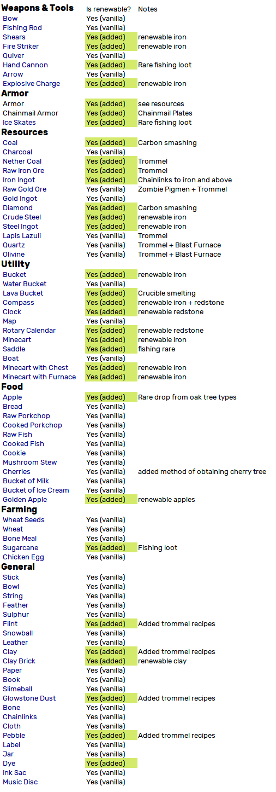 | 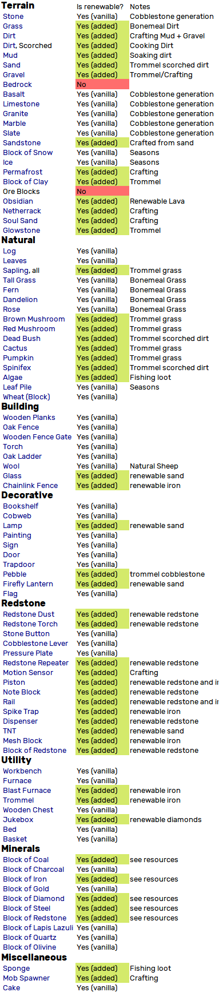 |
   

## Added recipes
### Crafting
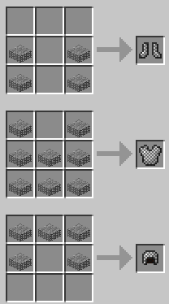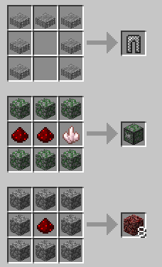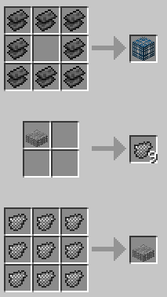
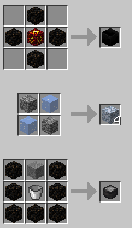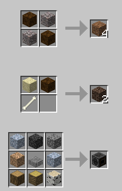
### Smelting
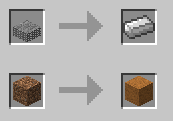
### Blasting

### Trommeling
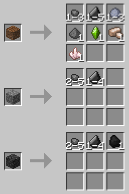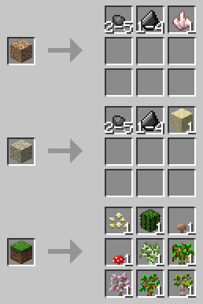
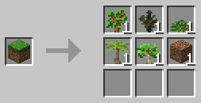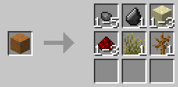

## Piston crushing

Cobblestone->gravel 20%

Gravel->Sand 20%

Sand->Clay 15%

???->???

## Skyblock Tips

1. The trommel should be one your first priorities as it gives you access to a large amount of resources through cobble-> gravel -> dirt -> sand etc.
2. "but you need iron to craft a trommel!", there are new ways of both generating iron as well as an alternate trommel recipe using chainmail, so get to killing some zombies!
3. Expand your stone generating factory! The generation of new lava requires the blistering heat of a blast furnace to be able to melt stone.
4. The nether coal needed to craft your first blast furnace will be hard to come by, making your own from soul sand will be the only way until you reach the nether.
5. Make use of [BTA's unique piston crushing technology](https://bta.miraheze.org/wiki/Advanced_Mechanics) to automate your stone generation!
### Diamond Generation
> 
> 
>"Rapid conversion of graphite to diamond requires pressures well above the equilibrium line: at 2000 K, a pressure of 35 GPa is needed."

--Wikipedia

Once you've crafted yourself a nice dense lump of carbon from all that excess charcoal you've accumulated, you somehow have to **_crush_** it under mindboggling pressures in an attempt to make those precious shiny rocks. You may soon find out though, that obsidian is just not quite strong enough to do the trick... if only there were something even more indestructible than obsidian...

## Future Plans
- Skyblock related advancements
- Void Nether?
